# Smart Notebook 🧠

> **AI-Powered Personal Knowledge Base**  
> Upload documents → Ask questions → Get cited, grounded answers

[](https://openjdk.java.net/)
[](https://spring.io/projects/spring-boot)
[](https://www.python.org/)
[](https://www.postgresql.org/)

---

## 📋 Table of Contents

- [What is Smart Notebook?](#-what-is-smart-notebook)
- [Key Features](#-key-features)
- [Architecture Overview](#-architecture-overview)
- [Technology Stack](#-technology-stack)
- [Getting Started](#-getting-started)
- [Project Structure](#-project-structure)
- [Configuration](#-configuration)
- [API Documentation](#-api-documentation)
- [Development](#-development)
- [Deployment](#-deployment)
- [Roadmap](#-roadmap)
- [Contributing](#-contributing)
- [License](#-license)

---

## 🎯 What is Smart Notebook?

Smart Notebook is an **AI-native personal knowledge base** that ingests your documents (PDFs, markdown, text files) and enables natural language querying with **cited, grounded answers** powered by state-of-the-art AI models.

### Why Smart Notebook?

- **No Vendor Lock-In:** Provider-agnostic model abstraction—swap between OpenAI, Anthropic, or Ollama via configuration
- **Cost-Aware Intelligence:** Confidence-based routing automatically selects the right model tier for each query
- **Production-Grade Architecture:** Async ingestion pipeline, circuit breakers, comprehensive observability
- **MCP Integration:** Both consumes and exposes tools via Model Context Protocol
- **Continuous Improvement:** Feedback loop tracks groundedness and system quality over time

---

## ✨ Key Features

### Core Capabilities

- **📄 Document Ingestion**
  - Multi-format support (PDF, Markdown, TXT)
  - Content deduplication via SHA-256 hashing
  - Async processing pipeline (upload never blocks queries)
  
- **🔍 Intelligent Retrieval**
  - Vector similarity search with pgvector
  - Heading-aware chunking for better context preservation
  - Configurable top-K retrieval with metadata filtering

- **🤖 Multi-Model AI**
  - **Development:** Ollama (Phi-3 Mini) - Free, runs locally
  - **Production:** Claude Sonnet, GPT-4o-mini, or any OpenAI-compatible API
  - Automatic model routing based on query complexity and retrieval confidence

- **🔗 MCP Integration**
  - **Server:** Exposes `search_notebook` tool for other AI agents
  - **Client:** Calls external MCP tool servers to enrich context

- **📊 Observability**
  - Every answer logged with chunks, scores, model used, latency
  - Groundedness scoring to detect hallucinations
  - Prometheus metrics + Spring Boot Actuator endpoints

### Advanced Features

- **Confidence-Based Routing**  
  High retrieval scores → Budget model | Low scores → Reranking → Escalation to frontier model

- **Circuit Breakers**  
  Automatic fallback when providers fail (Resilience4j)

- **Feedback Loop**  
  Track answer quality, generate patch plans for system improvement

- **Interface-Driven Design**  
  Every major component behind an interface—swap implementations without rewriting business logic

---

## 🏗️ Architecture Overview

Smart Notebook uses a **polyglot microservices architecture**:

```
┌───────────────────┐         ┌─────────────────────────┐
│   JAVA API        │         │   PYTHON WORKER          │
│   (Spring Boot)   │  Redis  │   (Ingestion Pipeline)   │
│                   │  Queue  │                           │
│ • Auth            │ ──────► │ • Extract (PyMuPDF)       │
│ • File Upload     │  JSON   │ • Chunk (heading-aware)   │
│ • Query Service   │ Schema  │ • Embed (MiniLM/OpenAI)   │
│ • Model Router    │ ◄────── │ • Index (pgvector)        │
│ • MCP Client      │         │ • MCP Server              │
└────────┬──────────┘         └────────────┬──────────────┘
         │                                  │
         └──────────┐    ┌─────────────────┘
                    ▼    ▼
              ┌─────────────────┐
              │   PostgreSQL    │
              │   + pgvector    │
              └─────────────────┘
```

### Four-Layer Design

| Layer | Responsibility | Key Components |
|-------|---------------|----------------|
| **API** | Auth, upload orchestration, query routing | `SourceController`, `QueryController` |
| **Context** | Vector retrieval, MCP tool calls | `VectorStore`, `McpToolProvider` |
| **Model** | LLM abstraction, provider adapters, routing | `ChatClient`, `ModelRouter`, `ModelRegistry` |
| **Feedback** | Answer logging, groundedness scoring | `GroundednessScorer`, `FeedbackService` |

### Low-Level Design — Interface & Class Diagram

```mermaid
classDiagram
    direction TB

    %% ── API LAYER ──────────────────────────────────────────

    class SourceController {
        +uploadDocument(file) UploadResponse
        +getStatus(documentId) StatusResponse
    }
    class QueryController {
        +query(QueryRequest) QueryResponse
    }
    class SourceService {
        -List~FileSource~ sources
        -MessagePublisher publisher
        +ingest(SourceReference) UploadResponse
    }
    class QueryService {
        -VectorStore vectorStore
        -ModelRouter router
        -ModelRegistry registry
        -ContextAssembler assembler
        +answer(QueryRequest) QueryResponse
    }

    SourceController --> SourceService
    QueryController --> QueryService

    %% ── FILE SOURCE (Strategy Pattern) ─────────────────────

    class FileSource {
        <<interface>>
        +fetchContent(SourceReference) InputStream
        +supports(sourceType) boolean
    }
    class LocalUploadSource {
        +fetchContent(ref) InputStream
        +supports(type) boolean
    }
    class S3Source {
        <<future>>
        +fetchContent(ref) InputStream
        +supports(type) boolean
    }
    class GoogleDriveSource {
        <<future>>
        +fetchContent(ref) InputStream
        +supports(type) boolean
    }

    FileSource <|.. LocalUploadSource
    FileSource <|.. S3Source
    FileSource <|.. GoogleDriveSource
    SourceService --> FileSource : resolves by type

    %% ── QUEUE LAYER ────────────────────────────────────────

    class MessagePublisher {
        <<interface>>
        +publish(documentId, payload) void
    }
    class RedisListPublisher {
        +publish(documentId, payload) void
    }
    class SqsPublisher {
        <<future>>
        +publish(documentId, payload) void
    }

    MessagePublisher <|.. RedisListPublisher
    MessagePublisher <|.. SqsPublisher
    SourceService --> MessagePublisher : enqueues

    %% ── MODEL LAYER ────────────────────────────────────────

    class ChatClient {
        <<interface>>
        +complete(ChatRequest) ChatResponse
    }
    class OllamaChatClient {
        +complete(req) ChatResponse
    }
    class AnthropicChatClient {
        +complete(req) ChatResponse
    }
    class OpenAIChatClient {
        +complete(req) ChatResponse
    }
    class ModelRegistry {
        <<interface>>
        +getChatClient(modelTier) ChatClient
        +getEmbeddingClient() EmbeddingClient
    }
    class ModelRouter {
        <<interface>>
        +route(QueryContext) RoutingDecision
    }
    class ConfidenceBasedRouter {
        +route(ctx) RoutingDecision
    }
    class EmbeddingClient {
        <<interface>>
        +embed(text) float[]
        +embedBatch(texts) List~float[]~
    }

    ChatClient <|.. OllamaChatClient
    ChatClient <|.. AnthropicChatClient
    ChatClient <|.. OpenAIChatClient
    ModelRouter <|.. ConfidenceBasedRouter
    ModelRegistry --> ChatClient : resolves
    ModelRegistry --> EmbeddingClient : resolves
    QueryService --> ModelRouter
    QueryService --> ModelRegistry

    %% ── VECTOR & CONTEXT LAYER ─────────────────────────────

    class VectorStore {
        <<interface>>
        +insert(docId, chunkVectors) void
        +search(queryVector, topK, filters) List~ScoredChunk~
        +deleteByDocId(docId) void
    }
    class PgVectorStore {
        +insert() void
        +search() List~ScoredChunk~
        +deleteByDocId() void
    }

    VectorStore <|.. PgVectorStore
    QueryService --> VectorStore

    class McpToolProvider {
        <<interface>>
        +invokeTool(toolName, params) String
        +listAvailableTools() List~String~
    }

    QueryService --> McpToolProvider : enriches context

    %% ── FEEDBACK LAYER ─────────────────────────────────────

    class GroundednessScorer {
        <<interface>>
        +score(answer, sourceChunks) double
    }
    class FeedbackService {
        -GroundednessScorer scorer
        +recordFeedback(queryId, answer, chunks) void
    }

    FeedbackService --> GroundednessScorer
    QueryService ..> FeedbackService : async after response
```



#### How to Add a New File Source (e.g., Google Drive)

1. Create `GoogleDriveSource implements FileSource`
2. Annotate with `@Service`
3. Spring auto-discovers it — no changes to `SourceService`

#### How to Add a New AI Provider

1. Create `CustomChatClient implements ChatClient`
2. Register in `ModelRegistry`
3. Update `application.yml` with provider config

---

## 🛠️ Technology Stack

### Backend Services

| Component | Technology | Purpose |
|-----------|-----------|---------|
| API Server | Spring Boot 3.4.3 + Java 21 | Virtual threads, production-grade REST API |
| Ingestion Worker | Python 3.12 | Document parsing, embedding generation |
| Message Queue | Redis Lists (dev) / AWS SQS (prod) | Async job processing |

### Data & AI

| Component | Technology | Purpose |
|-----------|-----------|---------|
| Database | PostgreSQL 16 + pgvector | Relational data + vector search in one DB |
| Embeddings (dev) | all-MiniLM-L6-v2 | Free, CPU-only, local embeddings |
| Embeddings (prod) | OpenAI text-embedding-3-small | High-quality embeddings |
| LLM (dev) | Ollama + Phi-3 Mini | Free, ~2.5GB RAM, local inference |
| LLM (prod) | Claude Sonnet / GPT-4o-mini | Production-quality responses |

### AI Frameworks & Protocols

- **Spring AI** - Model abstraction, vector store integration
- **MCP (Model Context Protocol)** - Tool invocation standard
- **LangGraph** (Python worker) - Pipeline orchestration

### DevOps & Observability

- **Docker Compose** - Local development environment
- **Prometheus** - Metrics collection
- **Spring Boot Actuator** - Health checks, metrics endpoints
- **Flyway** - Database migrations

### ♻️ Lifecycle Management (Resource Saving)

Smart Notebook includes built-in resource management to ensure Docker containers (which consume ~3GB RAM) are automatically shut down when you stop the application.

**Option 1: Using the Script (Recommended for Terminal)**
```bash
./run-smart-notebook.sh
```
- Sets `JAVA_HOME`
- Starts App & Docker
- **Auto-Cleanup:** Stops and removes containers when you press `Ctrl+C`

**Option 2: Using IDE (IntelliJ/Eclipse)**
- The application is configured (`application-dev.properties`) to automatically run `docker compose down` when you stop the application from your IDE.
- **Action:** Simply press the "Stop" button in your IDE, and Docker resources will be freed.

**Emergency Cleanup**
If resources are stuck (e.g. forced shutdown):
```bash
./cleanup.sh
```
 This force-stops all containers and prunes network/volume clutter.

---

## 🚀 Getting Started

### Prerequisites

- **Java 21+** (OpenJDK or Oracle JDK)
- **Python 3.12+**
- **Docker & Docker Compose**
- **Maven 3.9+**

### Quick Start (5 Minutes)

#### 1. Clone the Repository

```bash
git clone https://github.com/yourusername/smart-notebook.git
cd smart-notebook
```

#### 2. Start Infrastructure Services

```bash
docker compose up -d
```

This starts:
- PostgreSQL 16 with pgvector extension
- Redis (for queue)
- Ollama (for local LLM inference)

#### 3. Download AI Model (First Time Only)

```bash
docker exec -it smart-notebook-ollama-1 ollama pull phi3:mini
```

#### 4. Run Database Migrations

```bash
./mvnw flyway:migrate
```

#### 5. Start the API Server

```bash
./mvnw spring-boot:run
```

API will be available at `http://localhost:8080`

#### 6. Start the Python Worker (In a New Terminal)

```bash
cd apps/worker
pip install -r requirements.txt
python main.py
```

### Verify Installation

```bash
# Health check
curl http://localhost:8080/actuator/health

# Upload a document
curl -X POST http://localhost:8080/api/sources/upload \
  -F "file=@sample.pdf"

# Check processing status  
curl http://localhost:8080/api/sources/{document-id}/status

# Ask a question
curl -X POST http://localhost:8080/api/query \
  -H "Content-Type: application/json" \
  -d '{"question": "What are the key findings?", "topK": 5}'
```

---

## 📁 Project Structure

```
smart-notebook/
├── src/main/java/org/sirohi/smartnotebook/   # Spring Boot application
│   ├── source/                                # Upload & ingestion orchestration
│   ├── query/                                 # Query processing & response generation
│   ├── model/                                 # Model gateway & routing
│   │   ├── gateway/                           # ChatClient, EmbeddingClient interfaces
│   │   └── router/                            # Confidence-based routing logic
│   ├── mcp/                                   # MCP client integration
│   ├── feedback/                              # Answer logging & scoring
│   ├── vector/                                # Vector store abstraction
│   └── queue/                                 # Message publisher abstraction
├── src/main/resources/
│   ├── application.yml                        # Base configuration
│   ├── application-dev.yml                    # Dev profile (Ollama, Redis)
│   └── application-prod.yml                   # Prod profile (Claude/GPT, SQS)
├── apps/worker/                               # Python ingestion pipeline
│   ├── extractors/                            # PDF, Markdown, TXT parsers
│   ├── chunkers/                              # Document chunking strategies
│   ├── embeddings/                            # Embedding generation
│   ├── pipelines/                             # Pipeline orchestration
│   └── mcp_server/                            # MCP tool server
├── infra/
│   ├── docker/
│   │   ├── docker-compose.yml                 # Local dev environment
│   │   ├── Dockerfile.api                     # API server image
│   │   └── Dockerfile.worker                  # Worker image
│   └── migrations/                            # Flyway SQL migrations
├── docs/                                      # Architecture & design docs
│   ├── ARCHITECTURE.md
│   ├── DEVELOPMENT.md
│   ├── OPERATIONS.md
│   └── ADR/                                   # Architecture Decision Records
├── .github/
│   ├── prompts/                               # AI coding assistant prompts
│   └── workflows/                             # CI/CD pipelines
├── pom.xml                                    # Maven POM
└── README.md                                  # This file
```

---

## ⚙️ Configuration

### Environment Profiles

Smart Notebook uses Spring profiles to manage environment-specific configuration:

- **`dev`** - Local development (Ollama, Redis, free embedding models)
- **`prod`** - Production deployment (Claude/GPT, SQS, OpenAI embeddings)

### Key Configuration Properties

```yaml
# application-dev.yml (example)
spring:
  ai:
    ollama:
      base-url: http://localhost:11434
      chat:
        model: phi3:mini
    embedding:
      model: all-MiniLM-L6-v2
      
smart-notebook:
  model:
    routing:
      budget-tier: ollama-phi3
      frontier-tier: claude-sonnet
      confidence-threshold: 0.75
  vector:
    top-k: 5
    similarity-threshold: 0.7
```

### Environment Variables

| Variable | Description | Default |
|----------|-------------|---------|
| `ANTHROPIC_API_KEY` | Claude API key (prod) | - |
| `OPENAI_API_KEY` | OpenAI API key (prod) | - |
| `POSTGRES_HOST` | PostgreSQL host | `localhost` |
| `REDIS_URL` | Redis connection URL | `redis://localhost:6379` |

---

## 📚 API Documentation

### Source Management

#### Upload Document

```http
POST /api/sources/upload
Content-Type: multipart/form-data

file: <binary>
```

**Response:**
```json
{
  "documentId": "123e4567-e89b-12d3-a456-426614174000",
  "status": "PENDING",
  "filename": "document.pdf",
  "contentHash": "a3b8d1..."
}
```

#### Check Status

```http
GET /api/sources/{documentId}/status
```

**Response:**
```json
{
  "status": "READY",
  "chunkCount": 42,
  "processedAt": "2026-02-14T19:30:00Z"
}
```

### Query Service

#### Ask Question

```http
POST /api/query
Content-Type: application/json

{
  "question": "What are the main conclusions?",
  "topK": 5,
  "filters": { "documentId": "..." }  // optional
}
```

**Response:**
```json
{
  "answer": "Based on the documents, the main conclusions are...",
  "citations": [
    {
      "documentId": "123e4567...",
      "chunkId": "456e7890...",
      "content": "The study found...",
      "score": 0.89
    }
  ],
  "modelUsed": "claude-sonnet-3.5",
  "latencyMs": 1240
}
```

### Admin Endpoints

```http
GET /actuator/health              # System health
GET /actuator/metrics             # Prometheus metrics
GET /api/admin/quality            # Quality dashboard
```

---

## 💻 Development

### Running Tests

```bash
# Java unit tests
./mvnw test

# Python tests
cd apps/worker && pytest

# Integration tests
./mvnw verify -P integration-tests
```

### Coding Standards

**Java:**
- Constructor injection (no `@Autowired` on fields)
- Records for DTOs
- Interfaces for all swappable components
- Never import provider SDK types into business logic

**Python:**
- Type hints on all function signatures
- Abstract base classes for interfaces
- Pytest for testing

### Adding a New AI Provider

1. Implement `ChatClient` interface
2. Add provider-specific configuration in `application.yml`
3. Register in `ModelRegistry`
4. Add integration tests

Example:
```java
@Service
public class CustomChatClient implements ChatClient {
    @Override
    public ChatResponse complete(ChatRequest request) {
        // Provider-specific implementation
    }
}
```

---

## 🚢 Deployment

### Docker Production Build

```bash
# Build images
docker build -f infra/docker/Dockerfile.api -t smart-notebook-api .
docker build -f infra/docker/Dockerfile.worker -t smart-notebook-worker .

# Run
docker-compose -f docker-compose.prod.yml up -d
```

### Environment Setup

1. Set environment variables for API keys
2. Configure PostgreSQL connection
3. Set up AWS SQS (if using production queue)
4. Configure observability (Prometheus + Grafana)

### Health Checks

```bash
# API health
curl http://<host>/actuator/health

# Worker health  
# Check queue consumer logs
```

---

## 🗺️ Roadmap

### ✅ Phase 1: Foundation (Complete)
- [x] Document upload & ingestion
- [x] Vector search
- [x] Basic query with citations

### 🚧 Phase 2: Model Gateway (In Progress)
- [x] Multi-provider support (Ollama, Anthropic, OpenAI)
- [ ] Confidence-based routing
- [ ] Circuit breakers & fallbacks

### 📋 Phase 3: MCP Integration (Planned)
- [ ] MCP server (expose search_notebook tool)
- [ ] MCP client (call external tools)
- [ ] Unified context assembly

### 📋 Phase 4: Feedback Loop (Planned)
- [ ] Groundedness scoring
- [ ] Quality dashboard
- [ ] Automated patch plan generation

### 💡 Future Enhancements
- Hierarchical chunking strategies
- Multi-modal support (images, tables)
- Collaborative notebooks
- Fine-tuning on user feedback

---

## 🤝 Contributing

Contributions are welcome! Please see [CONTRIBUTING.md](CONTRIBUTING.md) for guidelines.

### Development Workflow

1. Fork the repository
2. Create a feature branch (`git checkout -b feature/amazing-feature`)
3. Make your changes following coding standards
4. Run tests (`./mvnw test && pytest`)
5. Commit with clear messages
6. Push to your fork
7. Open a Pull Request

---

## 📄 License

This project is licensed under the MIT License - see the [LICENSE](LICENSE) file for details.

---

## 🙏 Acknowledgments

- **Spring AI** - AI model integration framework
- **pgvector** - PostgreSQL vector extension
- **Anthropic & OpenAI** - AI model providers
- **Ollama** - Local LLM inference

---

## 📧 Contact

**Author:** Sirohi  
**Purpose:** Portfolio project demonstrating Staff/Principal-level backend engineering  
**Status:** Active development

For questions or feedback, please [open an issue](https://github.com/yourusername/smart-notebook/issues).

---

<div align="center">
  <strong>Built with ❤️ using Spring Boot, Python, and AI</strong>
</div>
